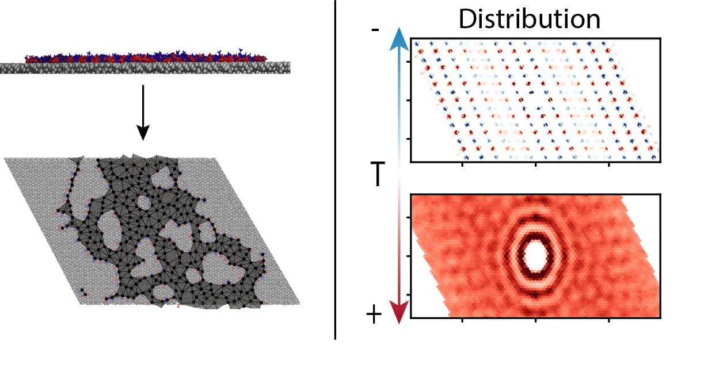

# Analyzing monolayer structures in molecular liquid films

Code for the extraction of monolayer structural information from molecular dynamics simulations used for the analysis of ionic liquid monolayer films on top of solid substrates.
This code is part of an associated publication available as a preprint on [arXiv](https://arxiv.org/abs/2403.08449). 
If you use the tools within the repository or a derivative thereof, please refer to the original publication:

```
@misc{hoellring2024criticalityimidazoliumionicliquid,
      title={Criticality in an imidazolium ionic liquid fully wetting a sapphire support}, 
      author={Kevin Höllring and Nataša Vučemilović-Alagić and David M. Smith and Ana-Sunčana Smith},
      year={2024},
      eprint={2403.08449},
      archivePrefix={arXiv},
      primaryClass={cond-mat.soft},
      url={https://arxiv.org/abs/2403.08449}, 
}
```
If you create a derivative tool, please also include this reference with your tool.

## What the tools in this repository can do

The following two pictures illustrate the capabilities of the tools within this repository:


## Building and Requirements

This repository uses `CMake` for generating build files and building the binaries from `C++`-code. 
Please refer to the [CMake Homepage](https://cmake.org/) for installation instructions. 
The CMake files have only been written for use on Linux and have been tested successfully on Ubuntu 18.04, 20.04 and 22.04. 

To build, this repository relies on the GROMACS API for reading XTC files. 
Due to changes in the GROMACS API and the set of by-default provided header files, we have included gromacs as a submodule (install and download after cloning this repository using  `git submodule update --init`), but we also need to link against an installed version of the GROMACS library. 
We have only tested this with versions 2021 and newer at time of publication.
Please refer to the [GROMACS homepage](https://www.gromacs.org/) for information on how to install the program on your respective operating system.
During building GROMACS, enable the flag `GMX_INSTALL_LEGACY_API=ON` like so:
```cmake .. -DGMX_INSTALL_LEGACY_API=ON -DGMX_BUILD_OWN_FFTW=ON```
If you don't, references to `gromacs/external/...` headers will fail.

Once all requirements are met, you can build the tools using the following commands
```
mkdir -p ./build    # Setup the build directory
cd ./build          # Go to the build directory
cmake ..            # Setup the cmake structure
cmake --build .     # Actually build the tools
```
This will also build all tools and tests in the `./planar_bin/` directory.

## Included tools

The code in this trajectory provides a set of tools used for the analysis described in the associated publication to extract certain measurements of a monolayer liquid film on top of a substrate. 
We here list the available tools, as well as a description of what they do. 
The tools are available in the `./planar_bin` directory after the code has been built using `cmake`. 
Further information on the detailed parameters and their functionality can be obtained by running
```./planar_bin/<toolname> --help```
which will present the full help text of the respective tool

### `extractFilmParams`

Tool to calculate the area and cicumference of monolayer films on sapphire. It takes two xtc input files/trajectories -i1 and -i2 with the positions of cations' and anion' centers of masses respectively. Both must have the same number of frames or the analysis will fail.
It then proceeds to iterate through the frames in the trajectory, constructs the representative graph for the film in each frame and outputs the resulting surface area and circumference measures to the output file.

Eventually, this program outputs a set of statistics files into the path denoted by the option `-o`: 
- 1 File `outline_area.dat` containing surface area and outline lengths per frame for the entire trajectory.
- 1 File `holes_statistics.dat` containing statistics on each individual hole detected within the trajectory during some frame.
- 1 File `face_statistics.dat` containing statistics on how often polygons with a certain number of vertices on their outline have been detected.


A flag `-d` with the option `-df <frame_number>` is also provided, which needs to be set like `-d 1 -df <frame_number>` to allow dumping the graph representation and the vertex positions from which the graph was generated to files in the current working directory.

**Please be aware that while the help text denotes i1 and i2 as input for cations and anions respectively, it does not really matter in which order these are provided or if they are split into anions and cations in each trajectory.
In fact, this input option as two separate trajectories was mostly motivated through our preprocessing steps.
Unlike for the `extractPlanarDistribution` tool, you cannot provide offsets for the two populations in each input trajectory. However, in principle, you can input the same trajectory containing both populations as both i1 and i2, which will not impact the area or circumference statistics. It may, however, impact statistics involving the number of vertices in an unpredictable manner. 
In the best case, it will simply double the number of vertices, but numerical inaccuracy of floating point calculations may lead to unpredictable results for the scenario of two identical points within the graph.**

### `extractPlanarDistribution`

Tool to calculate 2D relative density distributions of sets of two different populations of vertices/molecules in a monolayer configuration. 
If not provided with a monolayer configuration, the distribution of the projection onto the `xy`-plain will be calculated. 
It takes two xtc input files/trajectories -i1 and -i2 with the positions of, e.g., cations' and anion' centers of masses respectively but any other separation into two populations is possible. 
Both must have the same number of frames or the analysis will fail.
It then proceeds to iterate through the frames in the trajectory, and calculate the distribution of the second population relative to the first population in a grid of configurable size and resolution and it does the same for the distribution of other members of the first population relative to members of the first population (pairs of identical indices will be skipped if  `-s 1` is set). 
The grid is chosen to bin the coefficients of the PBC basis vectors in the `xy`-plain after linear decomposition of relative positions into the basis representation clipped to a `[-0.5, +0.5]` interval. Absolute distributions can be obtained by multiplying with the respective basis vector again.
The tools does not account for a change in the number of molecules per frame within a trajectory. It, however, does not rely on equal numbers of molecules in both trajectories. 
It furthermore averages its resulting statistics across all frames in the provided trajectories.
In principle, it would also be possible to provide individual atom positions to the code instead of COM for full molecules.
This would, however smear out the resulting distributions especially in `solid-like` systems.

Eventually, this program outputs a set of statistics files into the path denoted by the option `-o`: 
- 1 File `basis.dat` containing the basis vectors in the `xy`-plain used for the basis decomposition. These are extracted from the PBC data associated with the first input trajectory `-i1`
- 1 File `xy_distribution.dat` containing statistics on the distribution of the coeffcients in the basis representation of relative distances associated with the basis vectors in `basis.dat`. 


**Please be aware that i1 and i2 may denote the same input trajectory file in xtc format, as for this tool (in contrast to `extractFilmParameters`), the number of molecules of either population as well as the offset of the population in the trajectory can be provided via parameters of the tool**


## Included tests

### `GraphTest`

Running `./planar_bin/GraphTest` will create a graph representation of a simple vertex arrangement.
The source of this example can be seen `./src/GraphTest.cpp`.
Its results are output to `./tests/graph_simple_nonpbc.svg` for a non-periodic film example and `./tests/graph_simple_pbc.svg` for a pbc-connected film example.


### `GraphTest400K`

Running `./planar_bin/GraphTest400K` will create a graph representation of a vertex arrangement and pbc configuration dumped from the trajectory of the 400K-system in the associated publication.
The source of this example can be seen `./src/GraphTest400K.cpp`.
Its vertex inputs are read from `./tests/points.txt`.
Its results are output to `./tests/graph_400K.svg` for a visual representation of the resulting graph.
A reference for how the result should look is available at `./tests/reference/graph_400K.svg`. 

